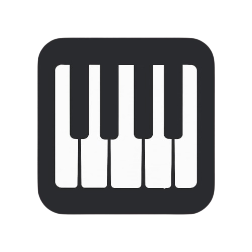
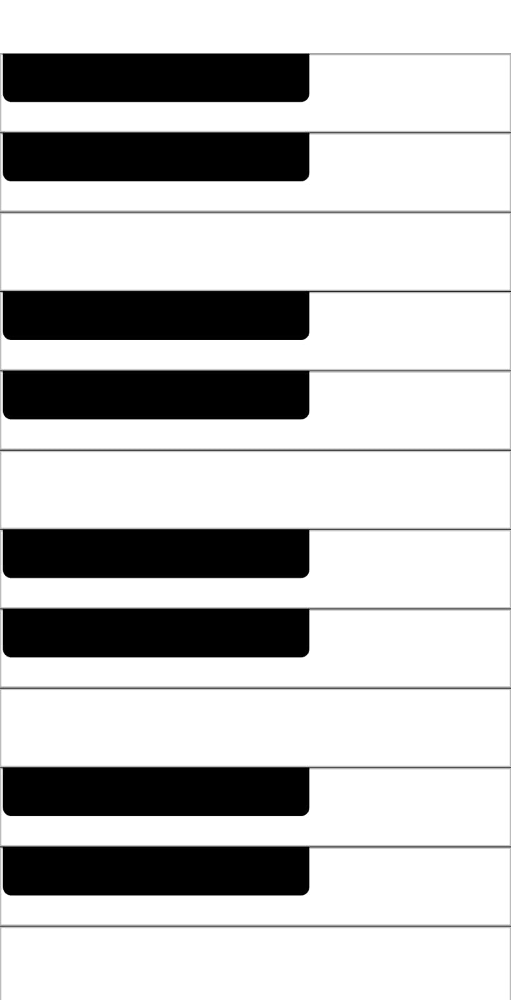

<p align="center">
  
</p>

---

# 🎹 Flutter Piano App

**Flutter Piano** is a simple and educational music application that allows users to play black and white piano keys that produce realistic sounds upon tapping. It is built with Flutter and designed with a clean, intuitive interface that offers an authentic piano playing experience.

---

## 🌟 Features

- 🎵 UI that mimics a real piano keyboard
- ⚫ Properly distributed black and white keys
- 🔊 Instant sound playback on key tap
- 🧱 Flexible layout using custom widgets
- 📱 Fully responsive on all screen sizes

---

## 📸 Screenshots

<p float="left">
  
</p>

---

## 🛠️ Tech Stack

- **Flutter** — Cross-platform UI toolkit
- **Dart** — Main programming language
- **audioplayers** — For playing sound files
- **Stateless Widgets** — To build the UI
- **Custom Widgets** — For clean and maintainable code structure

---

## 📋 Requirements

- ✅ Flutter 3.0 or higher
- ✅ Dart SDK
- ✅ Android SDK or Xcode

---

## ⚙️ Installation

```bash
# 1. Clone the repo
git clone https://github.com/your-username/flutter-piano.git

# 2. Navigate into the project directory
cd flutter-piano

# 3. Install packages
flutter pub get

# 4. Run the app
flutter run
